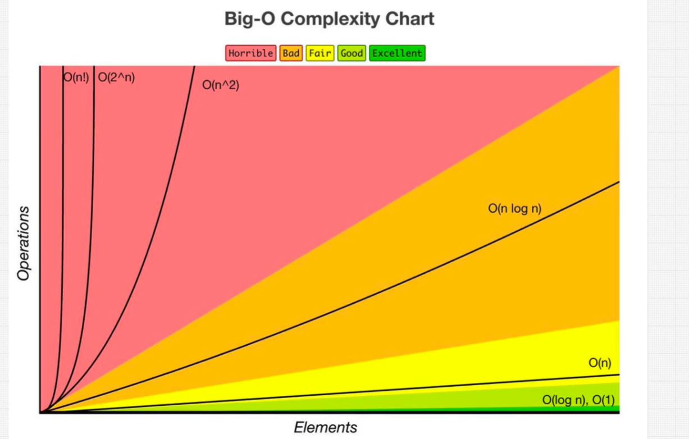
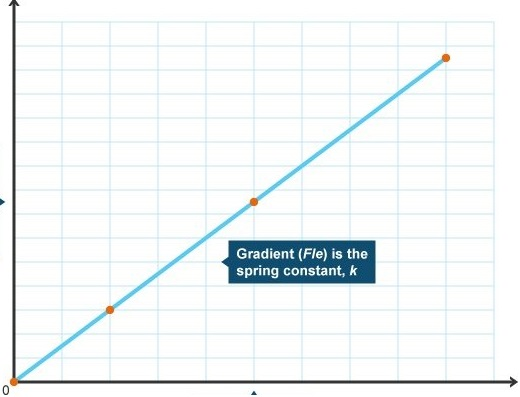
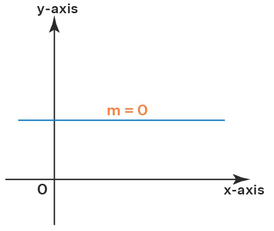
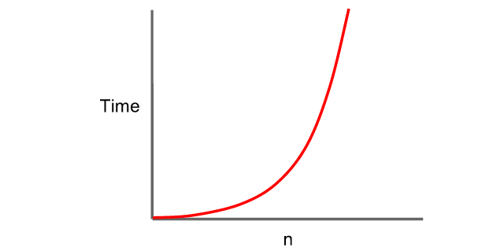

# Big O

Used to measure the scalability and performance of code. Big O is measured in functions using variables like `n`.

## Big O G


## Types of Big O
### Linear Time Complexity 
The `findNemo(arr, find)`findNemo function is represented as `O(n)` or as **Linear time complexity**. Which is the most common tpye of Big O complexity

Here the input `n` is directly related to the execution time in a straight line of constant gradient.



### Constant Time Complexity
For `logFirstBox` and `logTwoBox` function each has only one and two opperation repectively regardless the number of input elements provided `n`. So as `n` scales the number of opperations remain constant.



### Quadratic Time Complexity
Quadratic time complexity comes from 2 nested loops.

```
for (i in arr): 
    for (b in arr): // N
        doSomeLogic() // N * N
```
Here the Big O becomes n^2. Sequential operations (+) and nested (x).




## Big O Simplification Rules
1. Always take worst case.
    - When faced with multple cases always consider worst for input or flow of code.
2. Remove Constants.
    - Constants become insignificate with scale.
3. Different terms for inputs.
    - Input terms most of the time directly contribute to the complexity of the code so use different terms to help distinguish each input.
4. Drop non dominant terms.
    - Use the term for each distinct input that has the largest Big O notation eg:
    ```
    O(n^2 + 5n + 100) = O(n^2)
    \\ Reason being as N gets larger
    
    N = 1
    1 + 5 + 100

    N = 10
    100 + 50 + 100

    N = 500
    250,000 + 2500 + 100
    ```
    - The other terms become more insignificant with scale and when ploting a graph it comes closer to a `n^2`


## Space Complexity
Spaitial complexity determines how memory allocation will scale.

### Rules for spatial complexity
The following contribute to spatial complexty.

1. Varaible.
2. Data Structures.
3. Function calls.
4. Allocations.

eg: O(n)
```
def arrayOfHiNTimes(n):
    hiArray = [] # O(1)
    for i in range(len(n)): # O(1)
        hiArray[i] = "hi" # O(n)
    return hiArray
```


