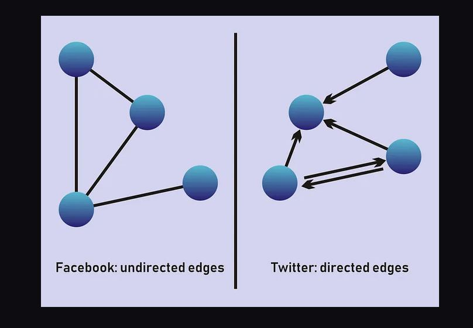
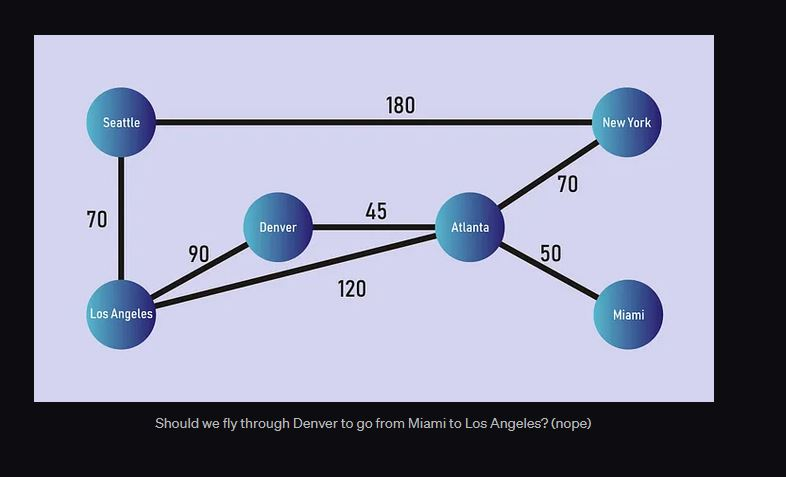
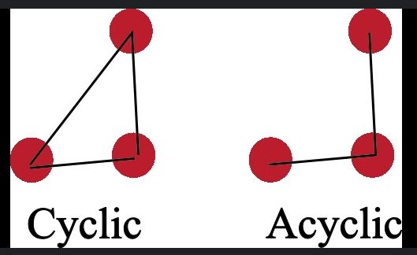
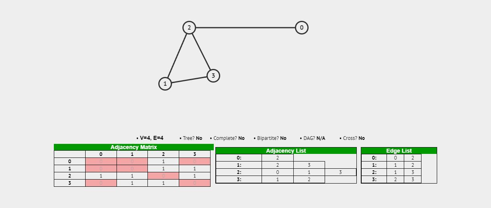

# Graphs

Used to represent linked or unlinked node/vertrices


## Types of graphs

### Directed / Undirected

`Directed` graphs have directions marked on edges which must be followed to traverse.

`Undirected` graphs have edges which can be tranversed in any direction.



### Weighted / Unweighted

`Weighted` graphs have a cost or a value assosiated with each edge. Which indicate a cost or property of the edge when traversing.

`Unweighted` graphs have edges have no assosiated properties.



### Cyclic / Acyclic

`Cyclic` graphs have at least one group of nodes which are connected with edges in a circular fashion.

`Acyclic` graphs have no nodes which are connected with edges in a circular fashion.




## Graphs Representations



### Edge Lists

```
graph = [[0,2],[2,3],[2,1],[1,3]]
```

### Adjacent Lists

```
graph = [[2],[2,3],[0,1,3],[1,2]]
```

### Adjacent Matrix

```
graph = [
    [0, 0, 1, 0],
    [0, 0, 1, 1],
    [1, 0, 1, 1],
    [0, 1, 1, 0],
]
```
